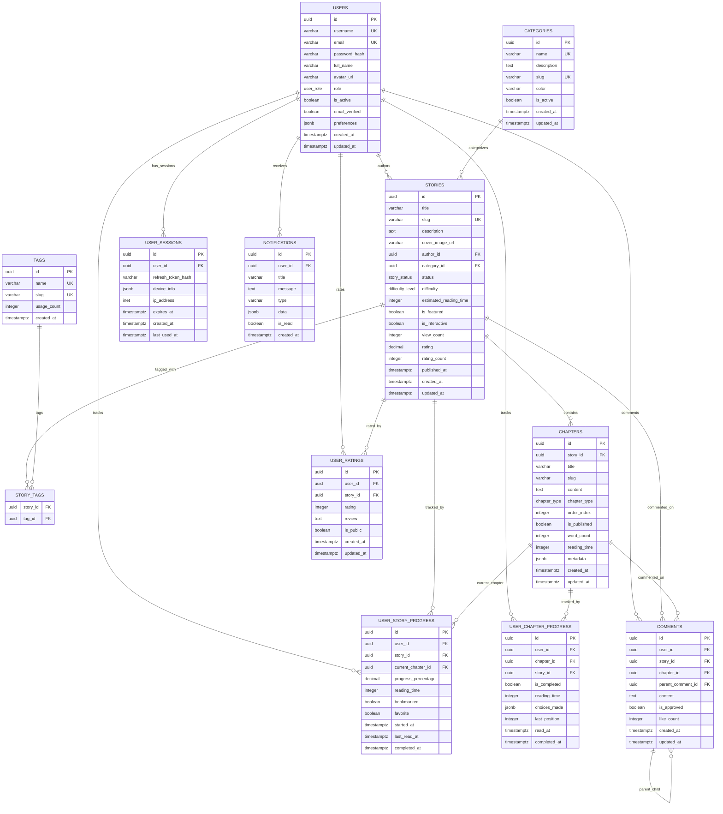

# Database Entity Relationship Diagram

## Quick Talk Tales - Database Schema

## Key Relationships

### Core Entities
1. **Users** - Central entity for authentication and user management
2. **Stories** - Main content entity authored by users
3. **Chapters** - Content sections within stories
4. **Categories** - Organization and classification of stories

### Progress Tracking
- **User Story Progress** - High-level progress tracking per user per story
- **User Chapter Progress** - Detailed progress tracking for each chapter
- Both entities work together to provide comprehensive reading analytics

### Content Organization
- **Tags** - Flexible labeling system with many-to-many relationship to stories
- **Categories** - Hierarchical classification system for stories

### User Engagement
- **User Ratings** - 1-5 star rating system with optional reviews
- **Comments** - Nested comment system for stories and chapters
- **Notifications** - System notifications for user engagement

### Authentication & Sessions
- **User Sessions** - Secure session management for JWT refresh tokens
- Supports multiple device sessions per user

## Database Features

### Performance Optimizations
- Comprehensive indexing strategy
- UUID primary keys for distributed systems
- JSONB columns for flexible metadata storage

### Data Integrity
- Foreign key constraints with appropriate cascade rules
- Check constraints for data validation
- Unique constraints for business rules

### Automated Features
- Automatic timestamp updates with triggers
- Automatic rating calculations
- Tag usage count tracking

### Scalability Considerations
- UUID keys support horizontal scaling
- JSONB allows schema flexibility
- Indexes optimized for common query patterns